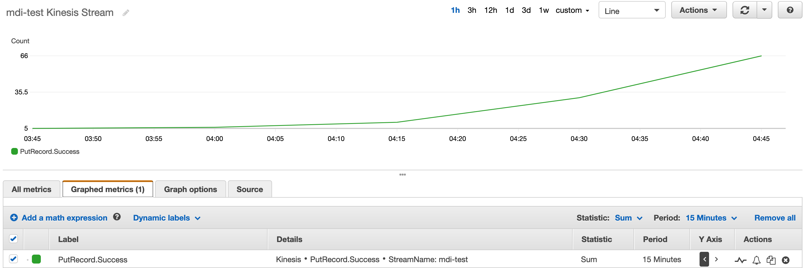

# flask-mdi
Flask based mobile device ingestion application

# Setup

All of the below assumes you have an active/working default AWSCLI profile configured on your machine. Running `aws sts get-caller-identity` in a fresh terminal will give you an indication.

First deploy a Kinesis Stream:

```bash
aws kinesis create-stream \
    --stream-name mdi-test \
    --shard-count 1 \
    --region us-east-1
```

Then configure the app:

```bash
cp mdi/config.{example.py,py}
vim mdi/config.py
# Modify the config file as needed
```

Install dependencies and run it:

```bash
python3 -m venv .venv
source .venv/bin/activate
pip install .
export FLASK_APP=mdi/app.py
export FLASK_SECRETS=config.py
export FLASK_ENV=development
export FLASK_DEBUG=1
flask run
```

# Testing

Open another tab/window in your terminal and `curl` the Flask app - there's only a single endpoint, `/`

```bash
# GET returns simple JSON body and 200, no data is stored
curl localhost:5000/ -X GET
{
  "app": "mdi",
  "message": "Welcome",
  "status": "success",
  "version": "0.0.1"
}

# Empty payload on POST returns error, 400
curl localhost:5000/ -X POST
{
  "app": "mdi",
  "message": "No JSON data provided",
  "status": "error",
  "version": "0.0.1"
}

# Any payload on POST returns 202
curl localhost:5000/ -X POST -d '{"hello": "world"}' -H "Content-Type: application/json"
{
  "app": "mdi",
  "message": "Data stored for processing",
  "status": "success",
  "version": "0.0.1"
}

# Let it run for a while
while True; do curl localhost:5000/ -X POST -d '{"hello": "world"}' -H "Content-Type: application/json"; sleep 1; done
```

See the metrics in Cloudwatch:



# Teardown

```bash
aws kinesis delete-stream \
    --stream-name mdi-test \
    --region us-east-1
```
